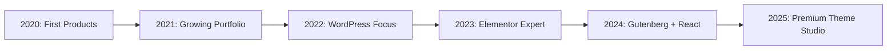

# 🎨 FrontTheme

<div align="center">


### Creative WordPress Themes for Modern Web

[](https://themeforest.net/user/fronttheme)
[](https://fronttheme.com)
[](https://themeforest.net/user/fronttheme)

**Building Beautiful, Functional WordPress Themes Since Day One**

</div>

---

## 🌟 About FrontTheme

**FrontTheme** is a creative WordPress theme studio based in **Sylhet, Bangladesh** 🇧🇩, dedicated to crafting premium themes for Elementor and Gutenberg. We believe in the perfect blend of **creativity and functionality** — where beautiful design meets powerful features.

### 🎯 Our Mission
> Create WordPress themes that designers love and developers trust.

---

## 🏆 Our Track Record

<div align="center">

| 📊 Metric |      🎯 Achievement       |
|:---:|:-------------------------:|
| **Total Sales** |   370+ on Envato Market   |
| **Products** |    26+ Items Approved     |
| **Customer Rating** |       ⭐⭐⭐⭐⭐ 5 Stars       |
| **Support Quality** | Professional & Responsive |
| **Active Since** |      Growing Strong       |

</div>

---

## 📦 Our Products

### 🎨 **WordPress Themes**
- ✅ **1 Live Theme** on ThemeForest
- 🚀 **More Themes Coming Soon**
- 💎 Elementor Pro Compatible
- 🧩 Gutenberg Block Ready
- 🛒 WooCommerce Integrated

### 🎨 **Design Templates**
- ✅ **7 XD/PSD Templates** on ThemeForest
- ✅ **4 HTML Templates** on ThemeForest
- ✅ **12 Graphic Templates** on GraphicRiver
- ✅ **2 3D Items** on 3DOcean (Archive)

---

## 🛠️ Technology Stack

<div align="center">

### **Core Technologies**


### **Development**


### **Design**


</div>

---

## 🎨 What Makes Us Different

```javascript
const frontTheme = {
  approach: "Design-first, functionality-always",
  specialization: ["Elementor", "Gutenberg", "WooCommerce"],
  commitment: "Follow WordPress standards religiously",
  support: "Professional, fast, friendly",
  updates: "Regular & WordPress-version compliant",
  quality: "Every pixel matters, every feature counts"
};
```

### 💡 **Our Philosophy:**
1. **🎨 Creative First** - Beautiful designs that stand out
2. **⚡ Performance Matters** - Fast, optimized, efficient
3. **📱 Mobile Responsive** - Perfect on every device
4. **🔧 Developer Friendly** - Clean code, well documented
5. **💚 Community Driven** - We listen, we improve, we grow

---

## 🚀 Coming Soon

### **In Development:**
- 🔥 New Creative WordPress Theme for ThemeForest
- 🆓 Free WordPress Plugins for WordPress.org
- 📚 Documentation Hub & Resources
- 🎓 Theme Development Tutorials
- 🛠️ Custom Elementor Widgets Pack

---

## 🌐 Where to Find Us

<div align="center">

[](https://fronttheme.com)
[](https://themeforest.net/user/fronttheme)
[](https://farukdesign.com)

</div>

---

## 📈 Growth Journey

<div align="center">



</div>

---

## 💼 For Customers

### 🎯 **Why Choose FrontTheme?**

- ✅ **Quality Guaranteed** - Every theme tested thoroughly
- ✅ **Regular Updates** - WordPress compatibility maintained  
- ✅ **Great Support** - Fast, helpful, professional
- ✅ **Documentation** - Detailed guides & video tutorials
- ✅ **Lifetime Updates** - Buy once, update forever
- ✅ **Made with Love** - Every detail matters to us

---

## 👨‍💻 Meet the Creator

**Faruk Ahmed** - Designer | Developer | Layout Enthusiast

A passionate WordPress theme developer from Bangladesh who believes in creating with purpose. With 5-star ratings, 139 reviews, and 370+ sales, Faruk brings creativity and technical excellence to every project.

> "Whatever WordPress adopts, I master. That's my commitment to excellence."

---

## 📊 GitHub Stats

<div align="center">


</div>

---

## 🤝 Contributing

We believe in giving back to the WordPress community. Stay tuned for:

- 🆓 Free WordPress plugins
- 📚 Open-source components
- 🎓 Educational resources
- 🛠️ Development tools

---

## 📜 License & Usage

All FrontTheme products follow **Envato License Terms** for ThemeForest items. 

For open-source projects (coming soon), we'll use GPL v2 or later to align with WordPress standards.

---

<div align="center">

## 💡 Let's Build Something Beautiful Together

### Follow our journey, star our repos, and join the FrontTheme family!


---

### 🌟 **"Where Creativity Meets Functionality"** 🌟

---

<sub>Made with ❤️ by FrontTheme | Sylhet, Bangladesh 🇧🇩</sub>

</div>
